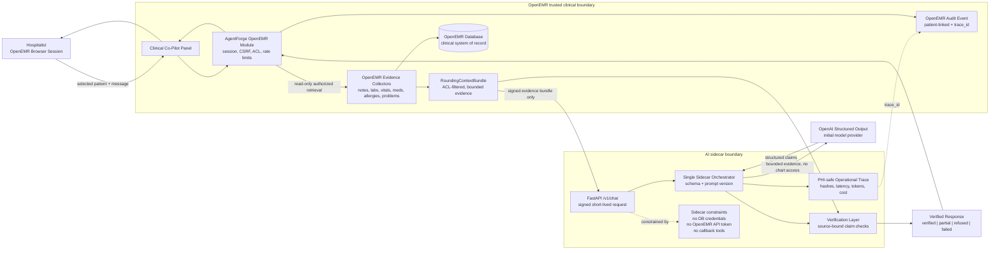

# Architecture Defense: Clinical Co-Pilot Hybrid Sidecar

## Executive Summary

The Clinical Co-Pilot is a hospitalist rounding assistant embedded inside OpenEMR. The committed project direction is intentionally narrow at the start: a read-only, source-backed retrieved chart brief for a selected demo patient, followed by patient-scoped follow-up questions. The goal is not to build a broad medical chatbot. The goal is to build a trustworthy architecture for clinical AI: OpenEMR remains the system of record, OpenEMR is the only component with direct clinical-data authority, AI behavior is isolated behind an in-repo FastAPI sidecar, and every factual clinical claim is verified against retrieved chart data before it reaches the physician.

This checkpoint is not a deployed working agent yet. The current deliverables are the public OpenEMR deployment, the audit findings in `AUDIT.md`, the target user and use cases in `USERS.md`, and this architecture defense. The sidecar, OpenEMR module shell, mock response flow, eval runner, and observability implementation are the next implementation phase of the same architecture, not a change in direction.

The central architecture choice is an in-repo hybrid sidecar. OpenEMR owns authentication, browser session, user identity, patient context, CSRF/session checks, role-based access control, audit alignment, and all direct access to clinical records. The AI sidecar lives inside the same forked OpenEMR repository, but it is a separate runtime boundary responsible for model orchestration, structured output validation, verification, observability, and eval execution. The sidecar does not receive database credentials, OpenEMR API tokens, broad service credentials, or delegated clinical-data permissions. It receives only signed, short-lived, minimum-necessary evidence bundles that OpenEMR has already assembled and ACL-filtered. It may transform that evidence into a verified response, but it may not fetch, expand, cache, or authorize clinical data.

This separation is deliberate. Putting all AI orchestration directly into OpenEMR's PHP runtime would reduce deployment complexity, but it would tightly couple experimental model behavior to the EHR and make tracing, evals, and iteration harder. Building a standalone chatbot would be faster to demo, but it would fail the core project requirement: the agent must live inside the OpenEMR codebase, respect the EHR workflow, and avoid becoming a second unmanaged clinical data surface. The hybrid model keeps OpenEMR as the trusted gateway while allowing the AI runtime to be isolated and testable.

The initial delivered agent capability is read-only. It will not write notes, orders, diagnoses, medication changes, billing records, or tasks. A hospitalist may use it to understand the retrieved chart faster, but not to delegate clinical decisions. The first capability is a chart brief for rounds: active problems, recent changes, notable labs/vitals, current medications, allergies, documented pending items, warnings about missing data, and citations to the underlying records. This should not imply complete inpatient MAR, order, or task coverage unless those OpenEMR adapters are actually implemented. Follow-up questions are allowed only inside the same patient context and only when the answer can be grounded in the evidence bundle.

Verification is the safety core. The model must return structured claims with source IDs, source record types, source field paths or note spans, extracted values, and source timestamps. A verification layer checks that each factual clinical claim is supported by the supplied evidence bundle, not merely that it cites a real source. Unsupported claims are removed, rewritten as uncertainty, or refused. The UI should display source chips or expandable citations so the hospitalist can inspect the evidence. Missing or stale data must be stated transparently; the assistant must not convert absent evidence into a confident clinical conclusion.

## Executive Position

The wrong project direction is a broad chatbot that appears fluent but cannot prove what it says. In a clinical setting, that is worse than an incomplete checkpoint because it trains the user to trust unverified text.

The defended direction is intentionally narrow:

- Target one user: a hospitalist preparing for inpatient rounds.
- Target one workflow: a patient-specific retrieved chart brief for rounds.
- Target one safety pattern: every clinical claim must cite a source record and the supporting field, value, or note span.
- Target one implementation mode: read-only, demo-data-only until compliance gates are met, built inside the OpenEMR fork, with mocked data allowed only behind the real response contract.

The first supported use cases are:

1. **Pre-round chart brief:** generate a source-backed brief for one selected patient before the hospitalist enters the room.
2. **Patient-scoped follow-up questions:** answer questions about changes, medications, labs, notes, allergies, or missing data inside the same patient context.
3. **Safety and refusal workflow:** refuse treatment directives such as starting, stopping, or continuing medication, and reframe them as record-backed issues for physician review.

The physician remains the human decision-maker. The assistant can summarize retrieved evidence and expose uncertainty, but it cannot make or execute clinical decisions.

The architecture is built around a simple principle: the sidecar may transform a pre-authorized evidence bundle, but it may not fetch, expand, cache, or authorize clinical data.

## System Architecture

### Architecture Diagram



### Components

1. **OpenEMR host application**
   - Owns authentication, browser session, patient context, CSRF/session checks, role-based access control, audit alignment, and direct clinical data retrieval.
   - Provides the embedded Clinical Co-Pilot panel inside the patient chart or encounter context.
   - Acts as the trusted gateway between the browser, OpenEMR database/services, and AI sidecar.
   - Performs server-side authorization and patient-context validation before any sidecar request is created.

2. **OpenEMR Clinical Co-Pilot module**
   - Receives browser chat requests through an OpenEMR module-local handler.
   - Validates the current user, CSRF token, selected patient context, encounter context when present, and required ACLs.
   - Applies per-user and per-session rate limits before any sidecar request is created.
   - Builds a `RoundingContextBundle` using existing OpenEMR services, controllers, or narrow module adapters.
   - Includes only ACL-filtered, minimum-necessary read-only clinical evidence in the bundle.
   - Creates a signed, short-lived sidecar request containing the evidence bundle and request metadata, not delegated tool permissions.
   - Displays the verified agent response, source list, warnings, and verification status.
   - Records an OpenEMR audit event for the AI chart-assist view and ties it to the sidecar trace ID.
   - Recommended repo location: `interface/modules/custom_modules/agentforge/`.

3. **AI sidecar service**
   - FastAPI service responsible for AI orchestration.
   - Source code is committed inside the OpenEMR fork, not maintained as a separate product repository.
   - Recommended repo location: `agentforge/sidecar/`.
   - Runs a single sidecar orchestrator, not a multi-agent system.
   - Uses OpenAI as the initial model provider because structured outputs fit the schema-first verification design.
   - Keeps the model provider behind a sidecar abstraction so Claude or open-source models can be evaluated later.
   - Runs model calls, structured output parsing, verification, tracing, and eval execution.
   - Does not receive database credentials, OpenEMR API tokens, delegated tool permissions, or broad service credentials.
   - Does not query OpenEMR tables, call OpenEMR APIs, decide authorization, or cache raw chart data.
   - Accepts only signed, scoped evidence bundles from OpenEMR.

4. **OpenEMR-owned read-only evidence collectors**
   - `collect_patient_snapshot`
   - `collect_recent_notes`
   - `collect_recent_labs`
   - `collect_vitals`
   - `collect_medications`
   - `collect_allergies`
   - `collect_problem_list`
   - `collect_pending_orders_or_tasks`, only if backed by a concrete OpenEMR data adapter
   - These collectors should reuse existing OpenEMR services or REST/FHIR controller logic where practical instead of inventing a parallel clinical data model.

5. **Verification layer**
   - Validates that every clinical claim has at least one source ID and a source-bound assertion.
   - Rejects unsupported facts.
   - Flags missing, stale, or conflicting data.

6. **Observability layer**
   - Requires local PHI-safe logs for every request.
   - Allows Langfuse for demo-data-only tracing or later redacted/self-hosted usage.
   - Tracks model calls, evidence collector status, token usage, cost, verification status, and failures.

### Repository Placement

The team constraint is that the agent must be built inside the same repository as OpenEMR. This architecture satisfies that by using one forked OpenEMR repository with internal areas of work:

- `interface/modules/custom_modules/agentforge/`: OpenEMR module, UI panel, module-local public handler, session/CSRF checks, ACL checks, audit event, and read-only evidence collectors into OpenEMR data.
- `agentforge/sidecar/`: FastAPI sidecar, model orchestration, verification, tracing, evals, and mocked response path.
- `agentforge/contracts/`: shared request and response schemas.
- `agentforge/evals/`: eval dataset and runners.
- `AUDIT.md`, `USERS.md`, and `ARCHITECTURE.md`: root-level project documents.

The sidecar is a separate runtime boundary, not a separate repository. This keeps development inside OpenEMR while avoiding a design where experimental LLM orchestration is tangled directly into core EHR PHP flows.

### OpenEMR Data Strategy

The module should not create a second clinical data model. The first implementation should assemble the `RoundingContextBundle` from existing OpenEMR service/controller paths where possible, including patient demographics, encounters, SOAP notes, vitals, problems, allergies, medications, documents, procedures, and FHIR-backed resources already exposed by OpenEMR. Where an existing service does not provide exactly the evidence shape needed for verification, the module can add a narrow adapter that returns normalized source records with stable IDs, field paths, timestamps, and raw values.

The evidence bundle is the only clinical context the sidecar receives. If a category is not implemented, timed out, blocked by ACL, or unavailable in the demo data, the bundle records that adapter status explicitly. The sidecar must describe that limitation instead of implying the data is absent from the chart.

The module should not send the entire chart to the model. OpenEMR should build a bounded evidence bundle, prioritize recent and high-signal records for the rounding workflow, and disclose omitted or unavailable categories. Large note text should be represented with source spans or bounded excerpts rather than unbounded raw notes.

### Agent Runtime, State, and Model Choice

The runtime is a single sidecar orchestrator rather than a multi-agent system. The workflow does not require autonomous agent collaboration; it requires controlled evidence transformation, schema validation, verification, and observability. Avoiding multi-agent fanout also reduces latency, cost, and audit complexity.

Conversation state is scoped to `conversation_id + patient_id + encounter_id + evidence_bundle_id`. Follow-up questions may reuse the same evidence bundle only while the OpenEMR patient and encounter context remain unchanged. Switching patients or encounters resets clinical context and requires OpenEMR to build a fresh evidence bundle. The sidecar may keep operational trace metadata, but it must not persist raw chart evidence as conversational memory.

OpenAI is the default initial model provider because structured output support fits the requirement that every clinical claim pass through schema-first verification. This is a provider choice, not a medical safety claim. The sidecar keeps model access behind a provider abstraction so the team can later compare Claude or open-source models using the same contracts and evals.

External dependencies should stay narrow: OpenAI for model calls and optional demo-only Langfuse for telemetry. All clinical data must come from OpenEMR-owned evidence collectors, not external clinical APIs or model-side retrieval.

Performance is accuracy-first. The system should aim for a first useful verified response quickly, but it must never skip verification to appear fast. Evidence collectors should have explicit timeouts; timed-out or unavailable collectors produce a `partial` response with visible warnings instead of blocking indefinitely or silently omitting categories.

The initial engineering target is a first useful verified response in roughly 10 seconds when the sidecar and core collectors are healthy. If a complete evidence bundle would take longer, the system should return a partial verified answer with collector warnings rather than wait for chart exhaustion. A fast unverified answer is not acceptable.

### Request Flow

1. Hospitalist opens a patient chart in OpenEMR.
2. Browser sends a message to the OpenEMR module-local chat handler.
3. OpenEMR validates session, CSRF, role, patient access, and patient context.
4. OpenEMR builds an ACL-filtered `RoundingContextBundle` from existing services/controllers or narrow module adapters.
5. OpenEMR signs a short-lived sidecar request containing the evidence bundle, request purpose, patient/encounter scope, user hash, and expiration timestamp.
6. Sidecar validates the signature and starts an internal trace.
7. Sidecar uses only the supplied evidence bundle. It cannot call back into OpenEMR or request more clinical data.
8. Sidecar asks the model for structured output using the evidence bundle.
9. Verifier checks source-bound claim support.
10. Sidecar returns only the verified response object and trace ID.
11. OpenEMR records the AI chart-assist audit event and renders the response with citations and warnings.

## Why In-Repo Hybrid Sidecar

### Safer Than an All-PHP In-App Agent

An all-PHP implementation would reduce deployment surface area, but it would make AI orchestration harder to isolate, test, and observe. The in-repo sidecar gives the project a clean boundary around experimental AI behavior while leaving OpenEMR's core clinical application intact. OpenEMR still owns all clinical-data authority because it is the context broker: it assembles the evidence bundle before the sidecar ever sees a request.

### Safer Than an External Standalone Chatbot

A standalone chatbot or separate agent repository would be faster to build, but it would not naturally inherit OpenEMR's session, patient context, and access model. It would also miss the project team's instruction to live and learn inside OpenEMR. It would risk becoming a second place where clinical data is copied, cached, and queried outside the EHR workflow.

### Best Fit for the Committed Direction

The in-repo sidecar can start mocked while preserving the real contract. The architecture defense can show the boundary and response schema even before every OpenEMR data adapter is complete.

The mocked path should still use the same `RoundingContextBundle` and verified response schema as the future implementation. A mock that skips the evidence bundle would demonstrate a chatbot, not the defended architecture.

This also matches the team and sprint constraints. OpenEMR is a large unfamiliar PHP application, while the AI orchestration, eval, and structured-output workflow can move faster in a small Python FastAPI sidecar. The design limits the amount of OpenEMR code that must change in the initial implementation phase while still forcing the team to integrate through OpenEMR's session, ACL, audit, and module patterns.

## Trust Boundaries

| Boundary | Risk | Control |
| --- | --- | --- |
| Browser to OpenEMR | User spoofs patient ID or bypasses session | OpenEMR validates session, CSRF token, role, and patient access server-side |
| OpenEMR to evidence collectors | Overbroad chart access | OpenEMR-owned ACL checks, patient-context validation, existing service/controller reuse, and narrow read-only collectors |
| OpenEMR to sidecar | Unauthorized service call or oversized disclosure | Signed, short-lived internal request containing only the minimum-necessary evidence bundle |
| Sidecar to data context | Sidecar becomes a second EHR or bypasses ACLs | No database credentials, no OpenEMR API token, no delegated tools, no callback channel, no raw chart cache |
| Sidecar to LLM | Excessive PHI exposure | Minimum-necessary demo patient evidence bundle; no direct database or OpenEMR API access |
| LLM to physician | Hallucinated or unsupported claim | Structured output plus source-bound verification before display |
| OpenEMR audit to sidecar trace | Split accountability | OpenEMR records patient-linked audit events; sidecar stores PHI-safe operational traces linked by trace ID |
| Logs and traces | PHI leakage | Local PHI-safe sidecar logs required; third-party traces demo-only or redacted/self-hosted |

## Public Interfaces

### OpenEMR Module Endpoint

`POST /interface/modules/custom_modules/agentforge/public/chat.php`

This endpoint follows the custom module pattern already used in OpenEMR. The browser may include patient and encounter IDs for UI continuity, but the server must validate them against the active OpenEMR session and ACLs before building the sidecar request.

Request:

```json
{
  "csrf_token_form": "openemr-csrf-token",
  "patient_id": "123",
  "encounter_id": "456",
  "conversation_id": "rounding-session-001",
  "message": "Give me a chart brief for rounds."
}
```

Response:

```json
{
  "schema_version": "agentforge.response.v1",
  "answer": "Verified natural language response",
  "sections": [
    {
      "id": "active_problems",
      "title": "Active Problems",
      "claim_ids": ["claim-001"]
    }
  ],
  "claims": [
    {
      "id": "claim-001",
      "text": "The retrieved problem list includes pneumonia.",
      "claim_type": "problem",
      "source_ids": ["problem-104"],
      "support_status": "supported"
    }
  ],
  "sources": [
    {
      "id": "problem-104",
      "record_type": "problem",
      "display": "Problem list item",
      "recorded_at": "2026-04-27T09:15:00-07:00",
      "field_path": "lists.title",
      "extracted_value": "Pneumonia"
    }
  ],
  "warnings": [
    {
      "code": "adapter_unavailable",
      "message": "Pending orders were not included in the retrieved evidence bundle."
    }
  ],
  "blocked_claims": [],
  "verification_status": "verified",
  "trace_id": "local-or-langfuse-trace-id"
}
```

### Sidecar Endpoint

`POST /v1/chat`

Authentication and scope:

- Internal network only where possible.
- Signed request from OpenEMR module.
- Expiration timestamp.
- Scope containing user hash, patient ID hash, encounter ID hash, request purpose, evidence bundle ID, and expiration timestamp.
- Patient IDs, encounter IDs, and user permissions are validated by OpenEMR before the sidecar request is created.
- Sidecar receives only minimum-necessary scoped context and the ACL-filtered evidence bundle. It receives no tool permissions and does not independently query OpenEMR tables or APIs.
- The model provider is configured inside the sidecar; browser and OpenEMR UI code never receive LLM API keys.

Sidecar request body:

```json
{
  "schema_version": "agentforge.request.v1",
  "request_id": "req-001",
  "conversation_id": "rounding-session-001",
  "expires_at": "2026-04-27T18:15:00-07:00",
  "purpose": "patient_rounding_brief",
  "scope": {
    "user_hash": "hash-of-openemr-user",
    "patient_hash": "hash-of-patient-id",
    "encounter_hash": "hash-of-encounter-id",
    "evidence_bundle_id": "bundle-001"
  },
  "message": "Give me a chart brief for rounds.",
  "evidence_bundle": {
    "id": "bundle-001",
    "created_at": "2026-04-27T18:10:00-07:00",
    "patient_context": {
      "patient_id": "123",
      "encounter_id": "456"
    },
    "sources": [
      {
        "id": "problem-104",
        "record_type": "problem",
        "recorded_at": "2026-04-27T09:15:00-07:00",
        "field_path": "lists.title",
        "value": "Pneumonia"
      }
    ],
    "adapter_status": [
      {
        "adapter": "pending_orders_or_tasks",
        "status": "unavailable",
        "reason": "No OpenEMR adapter implemented yet"
      }
    ]
  }
}
```

`verification_status` is one of:

- `verified`: all factual clinical claims are source-bound and supported.
- `partial`: the answer is verified against available evidence, but one or more collectors failed, timed out, or were unavailable.
- `refused`: the request asks for unauthorized data, a treatment directive, or a claim that cannot be safely grounded.
- `failed`: malformed model output, sidecar failure, or verifier failure prevents a controlled answer.

## Verification Strategy

The sidecar cannot stream unverified model text directly to the physician. It must produce a structured response containing claims, source IDs, source field paths or note spans, extracted values, and source timestamps, then pass that response through a verifier.

### Verification Rules

- Every factual clinical claim must have at least one source ID and a source-bound assertion.
- Medication, allergy, lab, vital, problem, and note claims must cite the specific retrieved record plus the supporting field path, extracted value, or note span.
- A real source ID is not sufficient by itself; the verifier must confirm the cited source actually supports the claim text.
- Claims without sources are removed or rewritten as uncertainty.
- Conflicting sources are surfaced as conflict, not resolved by model preference.
- Missing data is stated as missing from retrieved records, not absent from reality.
- Treatment recommendations are refused or reframed as record-backed issues for physician review.
- Adapter gaps are surfaced as retrieval limitations, not hidden behind confident summaries.
- Chart text, including note text, is untrusted input. Instructions embedded in notes cannot override system policy, developer policy, OpenEMR authorization, or verifier rules.
- The verifier does not use numeric confidence as a substitute for evidence. A factual claim is supported, unsupported, conflicting, or not stated.

### Domain Constraints

The first enforced clinical constraints are source attribution, stale or missing data warnings, conflict surfacing, and refusal of treatment directives. Medication, allergy, lab, vital, problem, and note claims must cite the retrieved record and the supporting field, value, or note span. Dosage thresholds, interaction checking, and institution-specific clinical rules are later expansions unless backed by explicit OpenEMR evidence and eval coverage.

### Example Safe Language

- Safe: "The retrieved medication list includes ceftriaxone, sourced from medication record `med-104`."
- Unsafe: "The patient should continue ceftriaxone."
- Safe: "I do not see today's CBC in the retrieved lab results."
- Unsafe: "No CBC was done today."
- Safe: "Pending orders were not included in the retrieved evidence bundle."
- Unsafe: "There are no pending orders."

## Failure Behavior

| Failure | Behavior |
| --- | --- |
| Unauthorized patient request | Refuse without confirming whether the patient exists |
| Evidence collector timeout | Return partial answer with warning and trace the timeout |
| Missing data | State that the data was not found in retrieved records |
| Conflicting notes | Surface the conflict with both sources |
| Ambiguous patient context | Refuse or ask the user to select a patient in OpenEMR; never guess |
| Ambiguous clinical question | Answer only the record-backed portion and ask for clarification |
| Prompt injection in chart text | Treat it as patient-record content, ignore instructions, and verify claims normally |
| Rate limit exceeded | Return a controlled retry-later error before calling the sidecar |
| Sidecar unhealthy | Return a controlled unavailable message or route to mock/off mode for checkpoint workflows |
| LLM malformed output | Retry once with structured schema; otherwise return controlled error |
| Verification failure | Block, rewrite, or refuse unsupported answer |
| Observability failure | Continue clinical response but log local operational warning |
| Sidecar requests additional data | Reject the request because the sidecar has no clinical data callback channel |

## Observability

Every request must produce two linked records:

1. An OpenEMR audit event that remains inside OpenEMR and may include the real patient ID according to normal OpenEMR audit policy.
2. A sidecar operational trace that is PHI-safe by default and uses hashes, bundle IDs, and trace IDs instead of raw chart identifiers.

The sidecar trace should include:

- User hash, patient ID hash, encounter ID hash, conversation ID, and environment.
- Evidence collectors by category, success/failure, and latency.
- Evidence bundle ID, adapter statuses, source count, and source categories.
- Model name, prompt version, token usage, and estimated cost.
- Verification result and number of blocked or rewritten claims.
- Final response status: verified, partial, refused, or failed.

The OpenEMR audit event should include the user, patient, action name such as `agentforge-chart-brief`, success/failure, and the sidecar trace ID. This keeps clinical accountability in OpenEMR while allowing the sidecar to stay operationally observable without becoming a PHI log store.

Local PHI-safe logging is the required baseline. Langfuse is acceptable for the current demo checkpoint because the project uses demo data only, and it is useful for LLM traces, sessions, observations, token/cost tracking, and eval scoring. Before any real PHI use, Langfuse or any third-party telemetry would require redaction, self-hosting or a compliant vendor relationship, BAA coverage, retention controls, and an explicit policy that raw chart text is not exported by default.

For operations, the sidecar should expose a health check and structured error counters. Real-time alerting is not required for the current checkpoint, but the production path should alert on repeated sidecar failures, verification failures, collector timeouts, and cost anomalies.

## Evaluation Plan

The eval suite should include cases that a happy-path demo would miss:

1. **Complete chart brief:** verifies summary quality and source-bound coverage.
2. **Missing labs:** confirms the agent says data is missing rather than inventing.
3. **Conflicting notes:** confirms the agent surfaces conflict.
4. **Unauthorized patient:** confirms refusal without leakage.
5. **Prompt injection in note:** confirms chart text cannot override policy.
6. **Unsupported prescribing request:** confirms refusal or safe reframing.
7. **Evidence collector failure:** confirms partial answer with transparent warning.
8. **Unsupported citation:** confirms the verifier blocks a claim that cites a real source that does not support the sentence.

Pass/fail should be based on source-bound support, safe language, refusal correctness, adapter gap transparency, and absence of unsupported clinical claims.

Ground truth for initial evals should come from the mocked or retrieved evidence bundle itself: expected source IDs, expected supported claims, expected missing-data warnings, and expected refusals. Automated evals should score contract adherence and safety-critical behavior. Human review can still judge clinical usefulness and wording, but it should not replace automated checks for source support and refusal correctness.

### Testing and CI

The first automated tests should cover schema validation for `RoundingContextBundle`, verifier behavior for supported and unsupported claims, and module-to-sidecar request/response contract compatibility. Integration tests should confirm OpenEMR builds or loads an evidence bundle, signs the sidecar request, receives a verified response, and maps `verified`, `partial`, `refused`, and `failed` statuses to controlled UI behavior.

CI should run lightweight schema tests and eval smoke tests before merging agent changes. The smoke set should include missing data, unsupported citation, prompt injection in a note, unauthorized patient, collector failure, and unsupported prescribing request. Broader regression evals can grow after the checkpoint, but the verification contract should be tested from the start.

## Cost and Scale Awareness

For the initial implementation phase, cost should be tracked per request, not guessed at the end. The conservative cost constraint is one primary OpenAI structured-output call plus one schema-repair retry at most. The sidecar should not use multi-agent fanout, background model calls, or separate judge calls for the first slice unless an eval shows they are necessary. Each trace should record model name, input tokens, output tokens, evidence source count, collector count, estimated cost, and verification retries.

Scaling assumptions:

- **100 users:** single sidecar service, simple MySQL, local trace table or demo-only Langfuse.
- **1,000 users:** add caching for patient snapshots, background pre-rounding summaries, stricter rate limits.
- **10,000 users:** queue non-urgent summarization, shard workloads, centralize audit logging, define data retention policies.
- **100,000 users:** hospital-grade deployment with enterprise identity, dedicated observability, regional data controls, formal incident response, and signed BAAs.

This is intentionally not calculated as `cost per token * users`; hospital usage depends on number of patients rounded, evidence collectors per patient, cache hit rate, model choice, verification retries, and observability retention.

## Deployment Plan

The current deployment target should optimize for checkpoint reliability while explicitly avoiding a production HIPAA claim.

Services:

- OpenEMR web service.
- MySQL service.
- AI sidecar service, built from the same OpenEMR fork.
- Optional OpenEMR-side Redis/cache service for non-sidecar patient snapshots with explicit retention limits.
- Local PHI-safe logging by default; demo-only Langfuse or self-hosted tracing if time allows.

The sidecar should have a health check endpoint so OpenEMR can fail closed with a controlled unavailable response. The rollback path is to disable the AgentForge module or route it to mock/off mode; rollback should not require database migration reversal for the initial read-only slice.

LLM API keys and sidecar signing secrets must be server-side configuration only. They are never committed, exposed in the browser, stored in client-side JavaScript, or logged in traces.

CI/CD for agent updates should require schema tests and eval smoke tests before deployment. A failed sidecar deployment should not break OpenEMR core workflows; the module should degrade to a controlled unavailable or mock/off state.

## Release and Maintenance Plan

The code remains inside the OpenEMR fork under licensing compatible with the project. Documentation should explain local setup, demo-data-only operation, safety limitations, and how to disable the module. No secrets, real PHI, raw prompt traces, or raw chart exports should be committed. Community engagement for the initial implementation is documentation-first; upstreaming or broader release should wait until the safety contract, evals, and module boundaries are stable.

Iteration should be eval-driven. New capabilities require a linked user use case, an evidence collector or adapter contract, verifier coverage, and at least one eval case. Long-term maintenance should include periodic review of prompts, schemas, eval failures, audit logs, model costs, and user feedback from clinicians.

## Checkpoint Scope And Implementation Path

Must have:

- OpenEMR running locally or publicly with demo data.
- Agent code and submission docs placed inside the OpenEMR fork.
- `AUDIT.md`.
- `USERS.md`.
- `ARCHITECTURE.md`.
- A request contract for `RoundingContextBundle`.
- A response contract for verified agent output.
- A mocked evidence bundle and example response that can be used for a visible demo.

Nice to have:

- Simple OpenEMR module shell inside `interface/modules/custom_modules/agentforge/` that builds or loads a mocked evidence bundle and calls the mocked sidecar.
- Demo-data-only trace from a mocked evidence-bundle request.
- One eval script over the mock response contract.

Explicitly out of scope:

- Real PHI.
- Production HIPAA claim.
- Autonomous treatment decisions.
- Chart writes.
- Broad multi-patient search.
- Full OpenEMR data adapter coverage.

## Known Tradeoffs

- **Sidecar adds deployment complexity:** Accepted because it isolates AI risk and improves observability while still living inside the OpenEMR fork. This requires explicit internal request signing, short-lived evidence bundles, and strict data minimization so the sidecar cannot become a second clinical-data authority.
- **Read-only scope limits demo flash:** Accepted because writes are high-risk and unnecessary for the first rounding workflow.
- **Mocked data may look less complete:** Accepted if the mock includes a realistic evidence bundle, adapter statuses, citations, and verification output rather than only a polished answer.
- **Third-party tracing is constrained:** Accepted because PHI-safe local logs are the baseline; Langfuse is demo-only unless redacted, self-hosted, or contractually covered.
- **Verification may reduce fluency:** Accepted because clinical correctness and traceability matter more than conversational polish.
